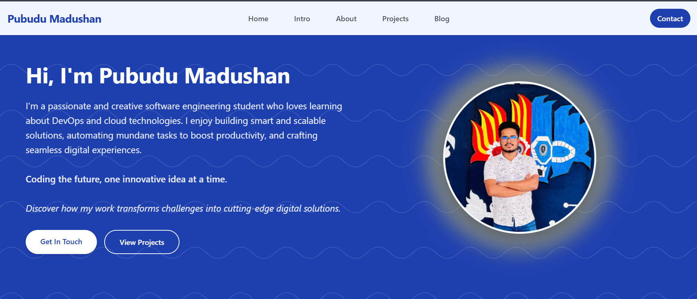

# Portfolio Website

## Home Page


## Project Description
This is a personal portfolio website showcasing projects, skills, and experiences. It is designed to provide an overview of professional achievements and serve as an online resume.

## Libraries Used
- HTML5
- CSS3
- JavaScript
- [AOS](https://michalsnik.github.io/aos/) (for Animations)
- [animate.css](https://animate.style/) (for Animations)

## Live Hosted Link
You can view the live website here: [Portfolio Website](https://pubudu-madhushan.netlify.app/)

## How to Run the Project Locally
1. Clone the repository:
    ```bash
    git clone https://github.com/your-username/SE2021060.git
    ```
2. Navigate to the project directory:
    ```bash
    cd SE2021060
    ```
3. Open the `index.html` file in your browser to view the website locally.

## Features
- Responsive design for mobile and desktop devices.
- Smooth scrolling and animations.
- Organized sections for projects, skills, and contact information.

## Feedback
If you have any suggestions or feedback, feel free to open an issue or contact me directly via email at [your-email@example.com].
